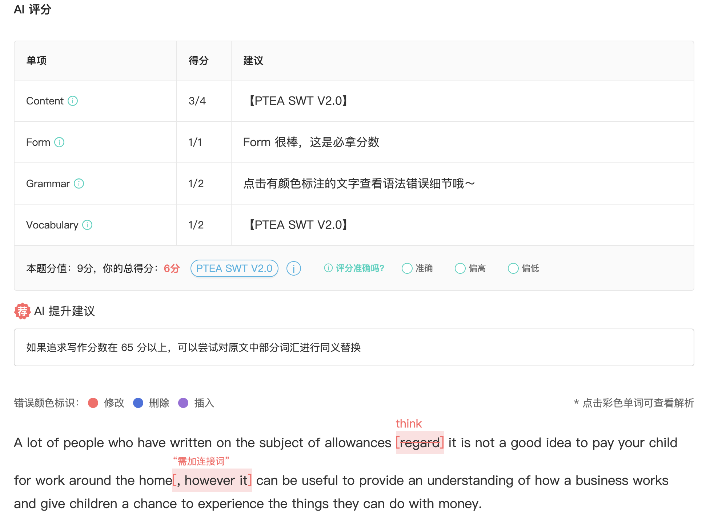
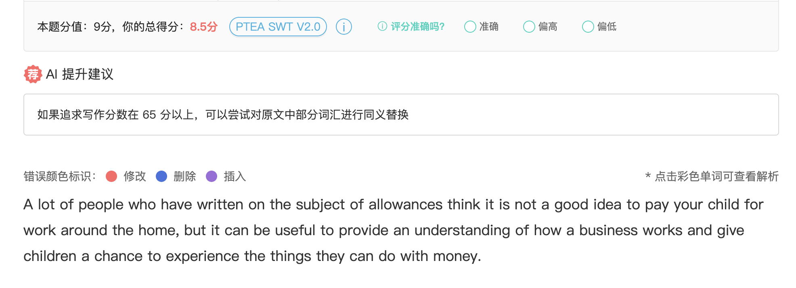
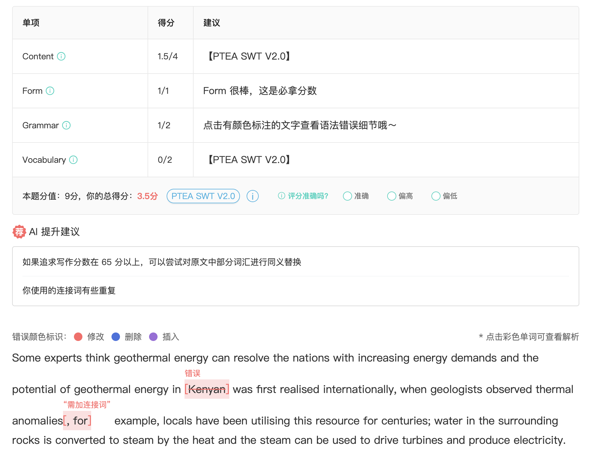
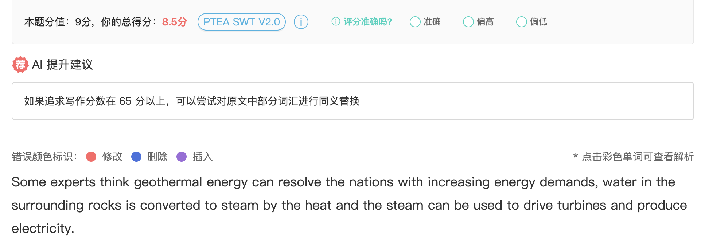
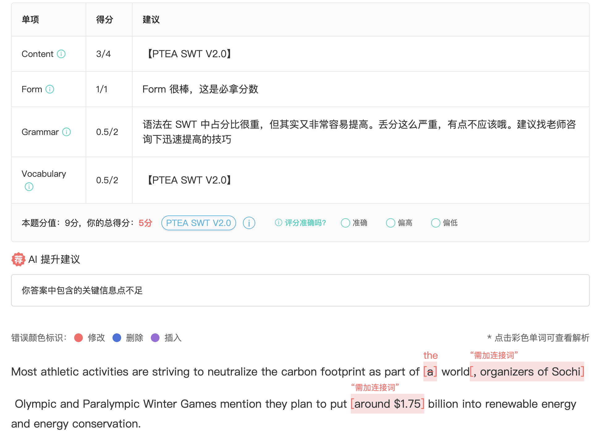

## Example1

https://www.ptexj.com/practice/swts/15

**Improvements**:

- Remove the rewritten word.
- Use simple connection word: `but` to replace `however` 

## Example2

Sometime when you are not sure about the content, do not paste them, more important: 不要随意给两个句子加因果关系，很容易丢大分！

https://www.ptexj.com/practice/swts/30

**Improvements**:

- Remove all sentences are not sure. Just keep the first and last sentence in the original text.

## Example3

Must guarantee no grammer problem!

https://www.ptexj.com/practice/swts/30

**Improvements**

- Just fix the grammer issue.

## Example4

Grad the key information and no grammer mistakes.

https://www.ptexj.com/practice/swts/1

**Improvements**

- Reorg the content.
- Fix the grammer issues.

