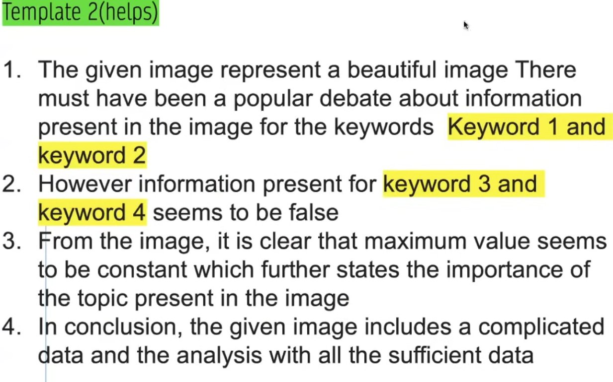
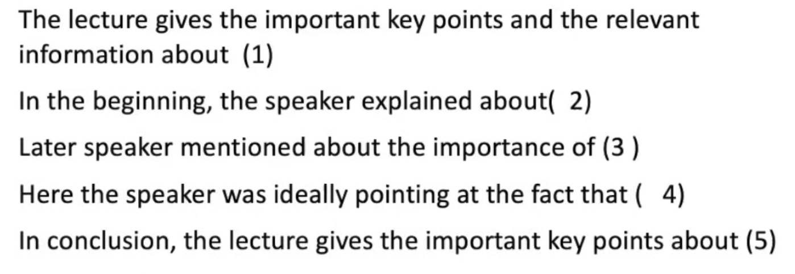

# Speaking

**DI (32%) > RS (18%) = SGD (18%) >  RA (10%)  > RTL (8%)**

**In Speaking module, click the `Next` immediately after you complete the reading, otherwise system would judge you are not smooth if the blank time is over 3 seconds. Likewise, read within 3 seconds when the recording begins.**

## RA: Read Aloud

It contributes **25 marks** to your speaking. 6-7 questions. (This module is not that  important after the changes in 2025. )

### Skills

1. Skip difficult words. When not sure of how to speak, either skip or speak in your own way (But skip is better, it can get more marks).
2. Speak 2 lines if you are really not confident of reading full sentence.
3. Not giving preference to "s" sounds. Like: galaxies, comets.
4. Give natural pauses for comma and full stop. Don't go fast and slow. Use natural speed, open mouth and speak, read with all the confidence.
5. Pitch issues: Maintain 130 above for a boy; Maintain 300 below for a girl. 
6. No ups and downs when speaking.

## RS: Repeat Setence

It contributes **30 marks** towards speaking and **30 marks** to your listening. 10-12 questions.

- **Fluency: 90%**
- Content : 10%
  - If 100% matches, 3/3
  - If 50% matches, 2/3
  - If less than 50% matches, 1/3
  - If nothing matches, 1/3
- Pronunciation

### Skills

1. Speak 60% but fluently. Let's say if there are 13 words, if you cannot listen to all 13 words, the recommendation is listening to only 8 words and remembering and speaking them fluently. (After the 8 words, close your ears. )
2. Never fumble or hesitate. Don't worry about the content.
3. Try to maintain the speaker's speed and pauses.
4. Do not try to speak everything.

## DI: Describe Image

4-6 questions. Give you a picture and describe it in 40 seconds.

### Skills

1. **Before the mic is on, put all your effort in the first 25 seconds and write 3 sentences. Then use a structure and just speak.**
2. Fluency is still important, at the same time, requires the content.
3. How to concentrate less on the keywords and more on fluency? Answer is a template:

## RTL: Retell Lecture

1-2 Questions. You will hear a lecture (2 minutes) and have 40 seconds to retell it.

- No need to retell 40 seconds, the more you speak, the more error you might make. 25-30 seconds is good enough.

### Skills

1. No fumble, no hestitation. Fluency is the key.

2. **Give more of content.**

3. When you listen, don't write. When you write, don't listen.

   - 5 seconds you listen, 5 seconds you write.

   - Write 4-5 small phases instead of just keywords.

4. Use the template and just speak like Read Aloud.

5. Worse case scenario: You only have written just 2 small phases.  **Repeat the templates with the phases you written**.

## ASQ: Answer Short Question

5-8 questions. Max **1-2 marks** to listening and speaking. Not a priority. 

### Skills

1. Speak the answer if you know, else repeat the question.
2. Not a priority. Don't pay too much time on this part.

## SGD: Summarize Group Discussion

### Skills

1. SGD is the same where you put all your efforts when you take the noted before the mic is on.
