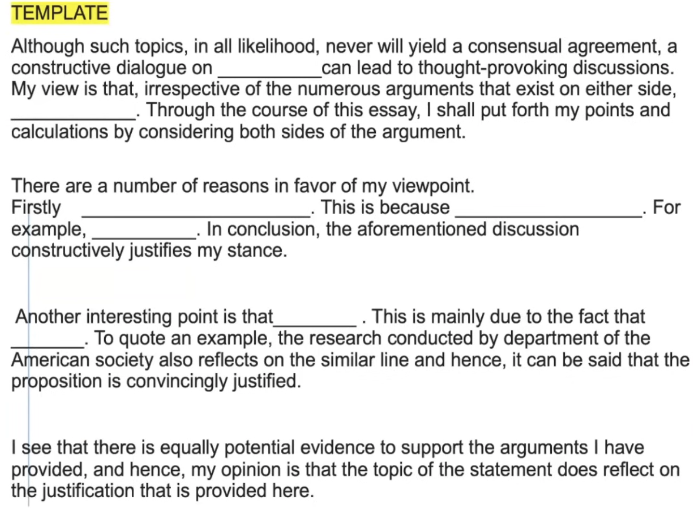

# Writing

## SWT: Summarize Written Text

1-2 questions, contributes 4-5 marks to writing and reading. Evaluation:

- Form: 2 marks (5-75 words)
- Grammar: 2 marks
- If there is spelling error, get 0 mark; If grammer mistakes are, get 0 mark; If over 75 words, get 0 mark.
- Content is not the priority, software doesn't understand the content.

### Skills

1. Copy 2 independent full sentences.
2. Add a comma, connect between the two sentences.
3. In the end: Put a full stop.
4. 40-50 words are enough.

## WE: Write Essay

Max 15 marks to writing. 1 question. Evaluation:

- Form: 200-300 words
- Development structure and coherence
- Grammar
- Spelling

### Skills

1. Use template.
2. Avoid using 1 word template.  
3. 200-300 words are expected, otherwise the marks would be affected.

Template: its development structure and coherence is perfect. 

