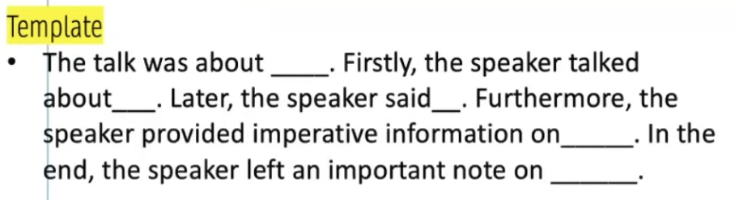

# Listening

This is the last module.

**WFD (41%) > SST (32%) > HIW( 22%) = FIB-L (10$)**

## SST: Summarize Spoken Text

Hear a short lecture and write the main contents in 50-70 words.  1-2 question. Contributes to listening and writing. Evacuation:

- Content: **4 marks**
- Form: 2 marks(50-70 words)
- Grammer: 2 marks
- Vocabulary: 2 marks
- Spelling: 2 marks

### Skills

Same as Retell Lecture. 5 seconds to listen and 5 seconds to write, don't do the the two things simultaneously. 

1. Use template. Content is more important than before.
2. Use phrases, not key words.
3. No spelling mistakes.
4. 60-70 words is ideal.
5. No grammer mistakes.
6. Same technique as Retell Lecture.
7. Don't listen and write at the same time.

## Multiple Choice

Peanut module. 

### Skills

Skip this module. 

**Don't check, select one answer and move on**. Wait for the audio ends, if you don't know the answer, just choose random one(don't choose two options) and click `Next` to enter to the next module. Don't spend extra time on this module, otherwise you might cannot complete the following modules which are more important. 

## FIB: Fill in the blanks

Contributes **12-15 marks** to listening and writing. 2-3 questions.

### Skills 

No overnight skills.

## Highlight Correct Summary

Penaut module. Max **1 mark**. 1-2 questions.

### Skills

Just wait for audio ends and click one option randomly and move on to the next module.

## SMW: Select Missing word

Select the correct option to replace the beep sound at the end. 1-2 questions. Max **1 mark**. 

### Skills

If you don't know the answer, just click one random answer, don't spend extra time on this module.

## Highlight Incorrect Word

Very very important. **12-15 marks** to reading and listening. 

### Skills

Listen and read consciously. 

## WFD: Write From Dictation

The big boss. The last module. 3-4 questions. **40-45 marks** to listening and writing. Evaluation:

- He goes to a market everyday and eats the mangoes. (10 words)

**Every correct word gives you 1 mark.**

### Skills

1. Sequence doesn't matter. 
   - A market he gose to everyday and eats the mangoes.
2. Add extra works(no limit, but you will not habe so much time. Max 40-50 seconds per question.)
   - He go goes to market markets every day everyday and eat eats the mangoes a the an. (single noun, plural noun, v1, v2, vs, a, an, the-- make sure you add these all)
3. Add extra spellings if not sure.
4. Capital or small letter doesn't matter.
5. Full stop or comma no marks. If you wish, you can add.
6. When listening, try to remember 3 phases, not single words.s
